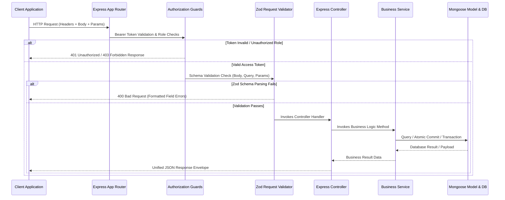

# ClassyERP Backend Server - Modular Monolith Architecture

Welcome to the backend engine of **ClassyERP**, an enterprise-grade modular monolith built with **Node.js, Express, TypeScript, and MongoDB**. The system features ACID database transaction mechanisms, strict schema-level data sanitization, token-authorized WebSocket synchronization, and role-based access control.

---

## 📖 Table of Contents

1. [💻 Tech Stack](#-tech-stack)
2. [⚙️ Architectural Blueprint & Request Flow](#️-architectural-blueprint--request-flow)
3. [📂 Repository Structure](#-repository-structure)
4. [🔌 Real-Time Event Architecture (Socket.io)](#-real-time-event-architecture-socketio)
5. [🛡️ Security & Middleware Pipeline](#️-security--middleware-pipeline)
6. [🗄️ Database Schemas & Data Models](#️-database-schemas--data-models)
7. [🚀 Installation, Configuration & Seeding](#-installation-configuration--seeding)
8. [📡 REST API Endpoints Specification](#-rest-api-endpoints-specification)
9. [❌ Error Handling Framework](#-error-handling-framework)

---

## 💻 Tech Stack

- **Runtime Environment**: Node.js (v20+) & Express.js
- **Programming Language**: TypeScript
- **Database Engine**: MongoDB & Mongoose (supports ACID transactions via replica sets or Atlas cluster sessions)
- **File & Media Storage**: Cloudinary (managed through Multer integration)
- **Real-Time Synchronizations**: Socket.io
- **Input Validation**: Zod
- **Encryption & Tokens**: JSON Web Token (JWT) & bcrypt

---

## ⚙️ Architectural Blueprint & Request Flow

The codebase is organized as a **modular monolith**. Each core business domain (e.g., Auth, Product, Sale, Dashboard, Upload) is completely encapsulated in its own module directory, containing its own routes, controller, service, interfaces, schemas, and validators.

### HTTP Request Lifecycle Diagram



### Architectural Subsystems

- **API Routing Router Layer**: Directs `/api/v1/` routes to corresponding module router registries.
- **Middleware Guard Filter Layer**: Authenticates JWT signatures, checks status (`isActive`), extracts token payload (`TJwtPayload`), and enforces role clearance limits.
- **Validation Parsing Layer**: Prevents malicious/dirty data from reaching logic controllers.
- **Business Logic Layer**: Controllers manipulate Express req/res. Services encapsulate transactional database logic, query building, calculations, and websocket triggers.
- **Data QueryBuilder Utility**: Orchestrates searchable, sortable, field-filtered, and paginated queries on Mongoose models.

---

## 📂 Repository Structure

```
server/
├── src/
│   ├── app.ts                  # App instantiation, server middlewares, rate limiters, and CORS config
│   ├── server.ts               # Database bootstrapping, HTTP server activation, Socket.io attachment, signal hooks
│   ├── seedAdmin.ts            # Production Admin seeding runner
│   ├── seedMockData.ts         # Development mock seeding script (Users, Products, Sales history)
│   ├── app/
│   │   ├── builder/
│   │   │   └── QueryBuilder.ts # Universal helper for search, filters, pagination, fields, and sorting
│   │   ├── config/
│   │   │   ├── index.ts        # Zod environment variable parsing and export config registry
│   │   │   ├── cloudinary.config.ts  # Cloudinary SDK credential registration
│   │   │   └── multer.config.ts      # Multer file size filters & storage profiles
│   │   ├── errors/             # Error structure handlers (ValidationError, CastError, ZodErrors, etc.)
│   │   │   ├── CustomAppError.ts
│   │   │   ├── handleCastError.ts
│   │   │   ├── handleDuplicateError.ts
│   │   │   ├── handleValidationError.ts
│   │   │   └── zodError.ts
│   │   ├── interface/          # Common application type definitions
│   │   ├── middlewares/        # Express pipeline request intercepts
│   │   │   ├── authorizationGuard.ts # Authenticate bearer tokens and check role scopes
│   │   │   ├── globalErrorHandler.ts # Unified application exceptions catcher
│   │   │   ├── notFound.ts           # 404 handler fallback
│   │   │   ├── requestValidator.ts   # Zod body/query/params validation parser
│   │   │   ├── safeJsonParser.ts     # JSON syntax error safety filter
│   │   │   └── sanitizer.ts          # XSS and NoSQL injection sanitizer
│   │   ├── modules/            # Capsule Monolith Modules
│   │   │   ├── auth/           # Users and authentication management module
│   │   │   ├── dashboard/      # Statistics, summaries, and inventory warning module
│   │   │   ├── product/        # Product inventory items module
│   │   │   ├── sale/           # Transactions and sales processing module (ACID)
│   │   │   └── upload/         # Optional generic media management helpers
│   │   ├── routes/
│   │   │   └── index.ts        # Root app.use route mapper
│   │   ├── socket/
│   │   │   ├── index.ts        # Handshake checks, connections, rooms, and namespace routines
│   │   │   └── socket.interface.ts   # Socket event payload type signatures
│   │   └── utils/
│   │       ├── catchAsync.ts   # Async routes error wrapper
│   │       └── send.response.ts# Normalized JSON client response structure
│   └── uploads/                # Local files temporary upload buffer
├── tsconfig.json               # TypeScript compilation configurations
├── package.json                # Dependencies, resolutes, and scripts
└── vercel.json                 # Deploy mappings for Vercel functions
```

---

## 🔌 Real-Time Event Architecture (Socket.io)

WebSocket connectivity enables instant UI synchronization across multiple dashboards whenever stock updates, low stock warnings, or sales events occur.

### Authentication Handshake

To prevent unauthorized listeners, a connection-level authentication check validates standard JWT tokens before finishing the handshake. The token is expected in the client's `auth` payload:

```javascript
import { io } from 'socket.io-client';

const socket = io('http://localhost:5000', {
  auth: {
    token: 'YOUR_JWT_ACCESS_TOKEN', // Retrieved from POST /auth/login
  },
});
```

### Channel Routing & Rooms

Upon connection, clients are grouped into Socket rooms based on their roles:

1. **`admin-manager-room`**: Joined only by clients with the `Admin` or `Manager` role. Used for sensitive dashboard telemetry, such as sale margins or low-stock alerts.
2. **`user-<userId>`**: A unique personal room assigned to each user ID for user-specific real-time messages.
3. **Global Channel**: All authenticated clients listen to standard events, such as public inventory count decreases.

### Triggered Socket Events

| Event Name      | Transmitted to       | Cause for Trigger                                                   | Payload Schema Details                                                      |
| :-------------- | :------------------- | :------------------------------------------------------------------ | :-------------------------------------------------------------------------- |
| `newSale`       | `admin-manager-room` | A sale checkout is successfully committed.                          | `{ saleId: string, grandTotal: number, soldBy: string, itemCount: number }` |
| `stockUpdated`  | All clients          | An item's inventory level is decremented due to a sale.             | `{ productId: string, name: string, stockQuantity: number }`                |
| `lowStockAlert` | `admin-manager-room` | An item's inventory level drops below `config.low_stock_threshold`. | `{ productId: string, name: string, stockQuantity: number }`                |

---

## 🛡️ Security & Middleware Pipeline

The server applies strict security controls:

1. **Rate Limiting (`express-rate-limit`)**:
   - **Global Limit**: `200` requests per 15-minute window for standard endpoints.
   - **API Limit**: Stricter limit of `100` requests per 15-minute window on `/api/v1/` routes.
2. **NoSQL Injection Guard (`express-mongo-sanitize`)**: Strips out input characters starting with `$` or `.` to prevent raw Mongo query overrides.
3. **XSS & Input Sanitization (`sanitizeInput`)**: Recursively sanitizes request payload values to strip out HTML tags and scripts.
4. **Parameter Pollution Prevention (`hpp`)**: Prevents array parameter attacks by whitelisting approved duplicate query parameters (`sort`, `filter`, `page`, `limit`, `search`).
5. **Helmet Security Headers (`helmet`)**: Configures CSP headers, prevents clickjacking, stops MIME sniffing, and enforces HTTPS.

---

## 🗄️ Database Schemas & Data Models

### 1. User Model (`User`)

```typescript
{
  name: { type: String, trim: true },
  email: { type: String, required: true, unique: true, trim: true, lowercase: true },
  password: { type: String, required: true, select: false },
  role: { type: String, enum: ['Admin', 'Manager', 'Employee'], default: 'Employee' },
  isActive: { type: Boolean, default: true },
  createdAt: Date,
  updatedAt: Date
}
```

### 2. Product Model (`Product`)

```typescript
{
  name: { type: String, required: true, trim: true },
  sku: { type: String, required: true, unique: true, trim: true, uppercase: true, index: true },
  category: { type: String, required: true, trim: true, index: true },
  purchasePrice: { type: Number, required: true, min: 0 },
  sellingPrice: { type: Number, required: true, min: 0 },
  stockQuantity: { type: Number, required: true, min: 0, default: 0 },
  image: { type: String, required: true }, // Cloudinary URL
  createdBy: { type: Schema.Types.ObjectId, ref: 'User', required: true },
  createdAt: Date,
  updatedAt: Date
}
```

### 3. Sale Model (`Sale`)

A Sale document records transaction details and retains name and price snapshots of products at checkout to protect historical sales records from future updates:

```typescript
{
  customer: { type: String, required: true, trim: true },
  items: [
    {
      product: { type: Schema.Types.ObjectId, ref: 'Product', required: true },
      productName: { type: String, required: true, trim: true }, // Historical snapshot
      quantity: { type: Number, required: true, min: 1 },
      unitPrice: { type: Number, required: true, min: 0 }, // Historical snapshot
      subtotal: { type: Number, required: true, min: 0 }
    }
  ],
  grandTotal: { type: Number, required: true, min: 0 },
  soldBy: { type: Schema.Types.ObjectId, ref: 'User', required: true },
  createdAt: Date,
  updatedAt: Date
}
```

---

## 🚀 Installation, Configuration & Seeding

### 1. Requirements

- Node.js version `20.17.0` or higher
- Yarn packet manager version `1.22` or higher
- MongoDB Server configured with **Replica Set** (required for Mongoose transaction sessions) or MongoDB Atlas cluster.

### 2. Configuration Setup

Create a `.env` file in the server root:

```bash
cp .env.example .env
```

| Env Variable             | Purpose                                 | Supported Formats / Default                                        |
| :----------------------- | :-------------------------------------- | :----------------------------------------------------------------- |
| `DB_URL`                 | MongoDB Connection URL                  | `mongodb+srv://...` or `mongodb://localhost:27017/?replicaSet=rs0` |
| `DATABASE_NAME`          | MongoDB database instance target        | E.g., `classy_erp`                                                 |
| `PORT`                   | Listening Port                          | `5000`                                                             |
| `NODE_ENV`               | Mode setting                            | `development` / `production`                                       |
| `CLOUDINARY_API_KEY`     | Cloudinary Key                          | Image storage access key                                           |
| `CLOUDINARY_API_SECRET`  | Cloudinary Secret                       | Image storage client secret                                        |
| `CLOUDINARY_CLOUD_NAME`  | Cloudinary Account Name                 | Cloudinary host storage profile                                    |
| `JWT_ACCESS_SECRET_KEY`  | Signing key for short-lived access JWTs | Highly secure random text string                                   |
| `JWT_REFRESH_SECRET_KEY` | Signing key for persistent refresh JWTs | Highly secure random text string                                   |
| `JWT_ACCESS_EXPIRES_IN`  | Lifespan of access tokens               | e.g. `1d`                                                          |
| `JWT_REFRESH_EXPIRES_IN` | Lifespan of refresh tokens              | e.g. `30d`                                                         |
| `ADMIN_EMAIL`            | Admin bootstrap login                   | Default seeded user email                                          |
| `ADMIN_PASSWORD`         | Admin bootstrap credentials             | Default seeded user password                                       |
| `LOW_STOCK_THRESHOLD`    | Warn triggers boundary                  | e.g. `5`                                                           |
| `CLIENT_URL`             | Frontend origin for CORS policy         | `http://localhost:5173`                                            |

### 3. Setup Commands

**Install dependencies:**

```bash
yarn install
```

**Seed Default Admin Account:**
Creates a default Admin user utilizing values from your `.env` config file (`ADMIN_EMAIL` and `ADMIN_PASSWORD`):

```bash
yarn seed
```

**Seed Mock Development Database:**
Seeds the database with test users, dummy products, and a historical timeline of sale records:

```bash
yarn seed:db
```

**Start Local Dev Instance:**

```bash
yarn dev
```

**Production Transpilation and Launch:**

```bash
yarn build
yarn start
```

---

## 📡 REST API Endpoints Specification

> [!NOTE]
> All secured endpoints require an `Authorization` header containing a valid bearer token (`Authorization: Bearer <JWT_TOKEN>`).

### Endpoint Security Scope Grid

| Scope Group           | Available Roles                | Actions                                                                                                         |
| :-------------------- | :----------------------------- | :-------------------------------------------------------------------------------------------------------------- |
| **Admin Only**        | `Admin`                        | Add user, deactivate user, view list of users, query specific user details.                                     |
| **Manager + Admin**   | `Admin`, `Manager`             | Create product, edit product, delete product, pull paginated sale history records, request dashboard stats.     |
| **All Authenticated** | `Admin`, `Manager`, `Employee` | Retrieve own profile data (`/me`), view products list, view product details by ID, submit sale checkout orders. |

---

### Module 1: Authentication & User Accounts (`/api/v1/auth`)

#### 1. Public Authentication Login

- **Route**: `POST /api/v1/auth/login`
- **Authentication**: Public
- **Request Body Payload**:
  ```json
  {
    "email": "admin@classyerp.com",
    "password": "AdminPass123!"
  }
  ```
- **Response Structure (200 OK)**: Sets a secure HTTP-Only `refreshToken` cookie and returns:
  ```json
  {
    "success": true,
    "statusCode": 200,
    "message": "User logged in successfully",
    "data": {
      "user": {
        "_id": "6689d0b81a02fb42ec2e0871",
        "name": "System Administrator",
        "email": "admin@classyerp.com",
        "role": "Admin",
        "isActive": true,
        "createdAt": "2026-07-06T12:00:00.000Z",
        "updatedAt": "2026-07-06T12:00:00.000Z"
      },
      "token": "eyJhbGciOiJIUzI1NiIsInR5cCI6IkpXVCJ9...",
      "accessToken": "eyJhbGciOiJIUzI1NiIsInR5cCI6IkpXVCJ9..."
    }
  }
  ```

#### 2. Get Current Authenticated Profile

- **Route**: `GET /api/v1/auth/me`
- **Authentication**: Bearer Token
- **Response Structure (200 OK)**:
  ```json
  {
    "success": true,
    "statusCode": 200,
    "message": "User profile retrieved successfully",
    "data": {
      "_id": "6689d0b81a02fb42ec2e0871",
      "name": "System Administrator",
      "email": "admin@classyerp.com",
      "role": "Admin",
      "isActive": true
    }
  }
  ```

#### 3. Create User Account (Admin Only)

- **Route**: `POST /api/v1/auth/users`
- **Authentication**: Bearer Token (Roles: `Admin`)
- **Request Body Payload**:
  ```json
  {
    "name": "Alice Vance",
    "email": "alice.manager@classyerp.com",
    "password": "UserPass123!",
    "role": "Manager",
    "isActive": true
  }
  ```
- **Response Structure (201 Created)**:
  ```json
  {
    "success": true,
    "statusCode": 201,
    "message": "User created successfully",
    "data": {
      "_id": "6689d0b81a02fb42ec2e087c",
      "name": "Alice Vance",
      "email": "alice.manager@classyerp.com",
      "role": "Manager",
      "isActive": true,
      "createdAt": "2026-07-06T12:05:00.000Z",
      "updatedAt": "2026-07-06T12:05:00.000Z"
    }
  }
  ```

#### 4. Get All Accounts (Admin Only)

- **Route**: `GET /api/v1/auth/users`
- **Authentication**: Bearer Token (Roles: `Admin`)
- **Supported Query Parameters**: Uses QueryBuilder (e.g., `?searchTerm=alice`, `?role=Manager`, `?page=1`, `?limit=10`)
- **Response Structure (200 OK)**:
  ```json
  {
    "success": true,
    "statusCode": 200,
    "message": "Users retrieved successfully",
    "data": [
      {
        "_id": "6689d0b81a02fb42ec2e087c",
        "name": "Alice Vance",
        "email": "alice.manager@classyerp.com",
        "role": "Manager",
        "isActive": true
      }
    ]
  }
  ```

#### 5. Update Account (Admin Only)

- **Route**: `PATCH /api/v1/auth/users/:id`
- **Authentication**: Bearer Token (Roles: `Admin`)
- **Request Body Payload**:
  ```json
  {
    "name": "Alice Cooper",
    "role": "Manager",
    "isActive": false
  }
  ```
- **Response Structure (200 OK)**:
  ```json
  {
    "success": true,
    "statusCode": 200,
    "message": "User updated successfully",
    "data": {
      "_id": "6689d0b81a02fb42ec2e087c",
      "name": "Alice Cooper",
      "email": "alice.manager@classyerp.com",
      "role": "Manager",
      "isActive": false
    }
  }
  ```

#### 6. Delete Account (Admin Only)

- **Route**: `DELETE /api/v1/auth/users/:id`
- **Authentication**: Bearer Token (Roles: `Admin`)
- **Response Structure (200 OK)**:
  ```json
  {
    "success": true,
    "statusCode": 200,
    "message": "User deleted successfully",
    "data": null
  }
  ```

---

### Module 2: Product & Inventory Management (`/api/v1/products`)

All creation and update operations for product records use **`multipart/form-data`** formatting to support image file uploads.

#### 1. Add New Product

- **Route**: `POST /api/v1/products`
- **Authentication**: Bearer Token (Roles: `Admin`, `Manager`)
- **Request Body Payload (Multipart Form-Data)**:
  - `name`: "Wireless ANC Headphones"
  - `sku`: "ELEC-HEAD-01"
  - `category`: "Electronics"
  - `purchasePrice`: `120`
  - `sellingPrice`: `199`
  - `stockQuantity`: `40`
  - `image`: _(File Binary upload - key name must be `image`)_
- **Response Structure (201 Created)**:
  ```json
  {
    "success": true,
    "statusCode": 201,
    "message": "Product created successfully",
    "data": {
      "_id": "6689d0b81a02fb42ec2e09a1",
      "name": "Wireless ANC Headphones",
      "sku": "ELEC-HEAD-01",
      "category": "Electronics",
      "purchasePrice": 120,
      "sellingPrice": 199,
      "stockQuantity": 40,
      "image": "https://res.cloudinary.com/cloud_name/image/upload/v1234/portfolio/uploads/unique-id.jpg",
      "createdBy": "6689d0b81a02fb42ec2e0871",
      "createdAt": "2026-07-06T12:10:00.000Z",
      "updatedAt": "2026-07-06T12:10:00.000Z"
    }
  }
  ```

#### 2. Get Paginated & Filtered Products

- **Route**: `GET /api/v1/products`
- **Authentication**: Bearer Token (Roles: `Admin`, `Manager`, `Employee`)
- **Supported Query Parameters (QueryBuilder)**:
  - `searchTerm`: Matches regex patterns on `name`, `sku`, and `category` (e.g., `?searchTerm=mechanical`).
  - Strict Filter: Exactly matches any other field in the database (e.g., `?category=Electronics&stockQuantity=40`).
  - `sort`: Order results (e.g., `?sort=sellingPrice` or `?sort=-createdAt`).
  - `page`: Page index (default: `1`).
  - `limit`: Items per page (default: `10`).
  - `fields`: Return selected fields (e.g., `?fields=name,sku,sellingPrice`).
- **Response Structure (200 OK)**:
  ```json
  {
    "success": true,
    "statusCode": 200,
    "message": "Products retrieved successfully",
    "meta": {
      "page": 1,
      "limit": 10,
      "total": 24,
      "totalPage": 3
    },
    "data": [
      {
        "_id": "6689d0b81a02fb42ec2e09a1",
        "name": "Wireless ANC Headphones",
        "sku": "ELEC-HEAD-01",
        "category": "Electronics",
        "purchasePrice": 120,
        "sellingPrice": 199,
        "stockQuantity": 40,
        "image": "https://res.cloudinary.com/...",
        "createdBy": {
          "_id": "6689d0b81a02fb42ec2e0871",
          "name": "System Administrator",
          "email": "admin@classyerp.com",
          "role": "Admin"
        }
      }
    ]
  }
  ```

#### 3. Get Product Details by ID

- **Route**: `GET /api/v1/products/:id`
- **Authentication**: Bearer Token (Roles: `Admin`, `Manager`, `Employee`)
- **Response Structure (200 OK)**:
  ```json
  {
    "success": true,
    "statusCode": 200,
    "message": "Product retrieved successfully",
    "data": {
      "_id": "6689d0b81a02fb42ec2e09a1",
      "name": "Wireless ANC Headphones",
      "sku": "ELEC-HEAD-01",
      "category": "Electronics",
      "purchasePrice": 120,
      "sellingPrice": 199,
      "stockQuantity": 40,
      "image": "https://res.cloudinary.com/...",
      "createdBy": {
        "_id": "6689d0b81a02fb42ec2e0871",
        "name": "System Administrator",
        "email": "admin@classyerp.com",
        "role": "Admin"
      }
    }
  }
  ```

#### 4. Update Product

- **Route**: `PATCH /api/v1/products/:id`
- **Authentication**: Bearer Token (Roles: `Admin`, `Manager`)
- **Request Body Payload (Multipart Form-Data)**:
  - `name`: "Wireless ANC Headphones Pro" _(Optional)_
  - `sellingPrice`: `219` _(Optional)_
  - `image`: _(Optional new File Binary upload)_
- **Response Structure (200 OK)**:
  ```json
  {
    "success": true,
    "statusCode": 200,
    "message": "Product updated successfully",
    "data": {
      "_id": "6689d0b81a02fb42ec2e09a1",
      "name": "Wireless ANC Headphones Pro",
      "sku": "ELEC-HEAD-01",
      "category": "Electronics",
      "purchasePrice": 120,
      "sellingPrice": 219,
      "stockQuantity": 40,
      "image": "https://res.cloudinary.com/new-path..."
    }
  }
  ```

#### 5. Delete Product

- **Route**: `DELETE /api/v1/products/:id`
- **Authentication**: Bearer Token (Roles: `Admin`, `Manager`)
- **Response Structure (200 OK)**:
  ```json
  {
    "success": true,
    "statusCode": 200,
    "message": "Product deleted successfully",
    "data": null
  }
  ```

---

### Module 3: Checkout & Sales Operations (`/api/v1/sales`)

#### 1. Process Checkout Order (Sale)

- **Route**: `POST /api/v1/sales`
- **Authentication**: Bearer Token (Roles: `Admin`, `Manager`, `Employee`)
- **Request Body Payload**:
  ```json
  {
    "customer": "Apex Gyms",
    "products": [
      {
        "product": "6689d0b81a02fb42ec2e09a1",
        "quantity": 2
      }
    ]
  }
  ```
- **Execution Mechanism**:
  1. Opens a database session transaction.
  2. Runs atomic updates to decrement product stock levels: `{ stockQuantity: { $gte: quantity } }`. If the inventory level is insufficient, the transaction rolls back.
  3. Saves the checkout transaction document.
  4. Commits the database transaction.
  5. Emits Socket.io notifications (`newSale`, `stockUpdated`, and conditional `lowStockAlert` triggers).
- **Response Structure (201 Created)**:
  ```json
  {
    "success": true,
    "statusCode": 201,
    "message": "Sale completed successfully",
    "data": {
      "_id": "6689d0b91a02fb42ec2e0aa5",
      "customer": "Apex Gyms",
      "items": [
        {
          "product": {
            "_id": "6689d0b81a02fb42ec2e09a1",
            "name": "Wireless ANC Headphones Pro",
            "sku": "ELEC-HEAD-01",
            "sellingPrice": 219
          },
          "productName": "Wireless ANC Headphones Pro",
          "quantity": 2,
          "unitPrice": 219,
          "subtotal": 438
        }
      ],
      "grandTotal": 438,
      "soldBy": {
        "_id": "6689d0b81a02fb42ec2e0871",
        "name": "System Administrator",
        "email": "admin@classyerp.com",
        "role": "Admin"
      },
      "createdAt": "2026-07-06T12:20:00.000Z",
      "updatedAt": "2026-07-06T12:20:00.000Z"
    }
  }
  ```

#### 2. Get Sales History

- **Route**: `GET /api/v1/sales`
- **Authentication**: Bearer Token (Roles: `Admin`, `Manager`)
- **Supported Query Parameters (QueryBuilder)**: Standard `searchTerm` (matches customer name), `sort`, `page`, `limit` pagination filters.
- **Response Structure (200 OK)**:
  ```json
  {
    "success": true,
    "statusCode": 200,
    "message": "Sales history retrieved successfully",
    "meta": {
      "page": 1,
      "limit": 10,
      "total": 1,
      "totalPage": 1
    },
    "data": [
      {
        "_id": "6689d0b91a02fb42ec2e0aa5",
        "customer": "Apex Gyms",
        "items": [
          {
            "product": "6689d0b81a02fb42ec2e09a1",
            "productName": "Wireless ANC Headphones Pro",
            "quantity": 2,
            "unitPrice": 219,
            "subtotal": 438
          }
        ],
        "grandTotal": 438,
        "soldBy": {
          "_id": "6689d0b81a02fb42ec2e0871",
          "name": "System Administrator",
          "email": "admin@classyerp.com",
          "role": "Admin"
        },
        "createdAt": "2026-07-06T12:20:00.000Z"
      }
    ]
  }
  ```

#### 3. Get Sale Record Details by ID

- **Route**: `GET /api/v1/sales/:id`
- **Authentication**: Bearer Token (Roles: `Admin`, `Manager`)
- **Response Structure (200 OK)**: Returns the matching Sale record object populated with soldBy details and nested products.

---

### Module 4: Dashboard Telemetry (`/api/v1/dashboard`)

#### 1. Get Dashboard Summary Statistics

- **Route**: `GET /api/v1/dashboard`
- **Authentication**: Bearer Token (Roles: `Admin`, `Manager`)
- **Response Structure (200 OK)**:
  ```json
  {
    "success": true,
    "statusCode": 200,
    "message": "Dashboard statistics retrieved successfully",
    "data": {
      "totalProducts": 24,
      "totalSales": 13,
      "lowStockProducts": [
        {
          "_id": "6689d0b81a02fb42ec2e09aa",
          "name": "Pro Streamer Microphone",
          "sku": "ELEC-MICR-04",
          "stockQuantity": 4,
          "sellingPrice": 125
        }
      ]
    }
  }
  ```

---

## ❌ Error Handling Framework

All runtime errors are intercepted by the `globalErrorHandler` middleware to format raw Mongo/Node errors into a clean, standardized JSON format.

### Unified Error Response Template

```json
{
  "success": false,
  "message": "User-friendly description of the error cause",
  "errorSources": [
    {
      "path": "name_of_the_invalid_field_or_subpath",
      "message": "Specific validation failure instruction message"
    }
  ],
  "stack": "Stack trace details printed only in development environment"
}
```

### Supported Exception Mappings

1. **Zod Validation Error (`ZodError`)**: Maps field-level parsing validation failures to `errorSources` (HTTP Status: `400 Bad Request`).
2. **Mongoose Schema Validation Error (`ValidationError`)**: Formats validation constraint violations configured on schemas to `errorSources` (HTTP Status: `400 Bad Request`).
3. **Mongoose ID Cast Error (`CastError`)**: Triggers when an ID query parameter does not match the standard ObjectId format (HTTP Status: `400 Bad Request`).
4. **Duplicate Document Key Error (`11000`)**: Triggered by database indexes, such as when creating a product with an existing SKU (HTTP Status: `409 Conflict`).
5. **Custom Application Error (`CustomAppError`)**: Internal application exceptions thrown by services or controllers (e.g., "Insufficient stock level", "Unauthorized role").
